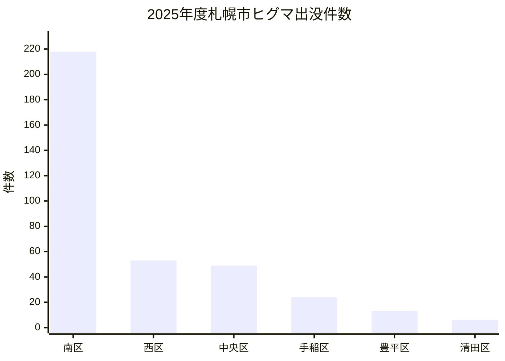
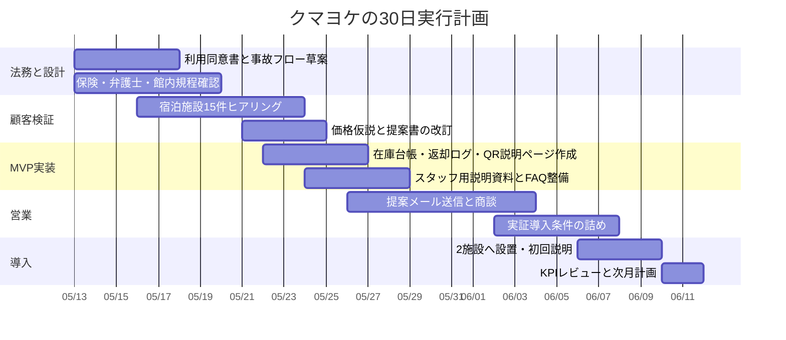

# クマヨケ徹底検証レポート

## エグゼクティブサマリー

まず確認として、添付の「個人副業案の徹底検証プロンプト」と「20260512_クマヨケ_要件.md」の両方を読了し、本レポートはその2資料を一次入力として作成している。fileciteturn0file1 fileciteturn0file0

結論から言うと、**クマヨケは「需要はあるが、事業の肝はスプレーそのものではなく、安全運用の設計にある」副業案**であり、判定は**条件付きGo**である。理由は明確で、山林に入る人に対して公的機関が熊撃退スプレーの携行を推奨しており、しかも航空会社は熊よけ／熊撃退スプレーの機内持ち込み・受託手荷物預けを認めていないため、「現地で借りたい」という痛みは実在する。一方で、札幌市は「ヒグマに出遭わないこと」が最重要と明記しており、スプレーはあくまで最終手段である。したがって、クマヨケが売るべきものは“安心を保証する魔法の缶”ではなく、**宿泊施設向けの安全補助オペレーション一式**である。citeturn22view2turn20view2turn10search0turn19view0

勝ち筋は、資料にある候補のうち**支笏湖・千歳ゲートウェイ・定山渓**を優先し、**宿泊施設向けB2B2C**で始めることだ。札幌市全域のホテルを広く狙うよりも、空港から自然エリアへ向かう導線上の施設、または温泉地・湖畔・アクティビティ拠点に近い施設のほうが適合度が高い。既存事業者をみても、現地受け取り、身分証確認、保証金、使用時精算、重量確認、短い安全説明が標準化されており、ここを外すと法務・安全リスクが急上昇する。citeturn24view0turn22view1turn31view0turn17view5turn13search5turn17view7

最大の論点は**価格**である。資料にある「7〜8月限定・2本セットで3万円前後」は、**再利用前提で極薄利、初年度調達前提だと赤字化しやすい**。公式価格ベースでみても、クマよけスプレーは1本12,100円クラスから20,350円クラスまであり、2本導入・ホルスター・保管箱・説明資料・運用人件費まで入れると、3万円は“テストのための受注価格”にはなっても、持続的な副業価格にはなりにくい。**標準価格は4.98万円前後**、少なくとも**3万円は「証拠づくり用の初回実証」以外では避ける**のが妥当である。citeturn30search6turn30search1turn31view0

## 前提と検証フレーム

添付資料から読み取れる現在の事業仮説は、**北海道の熊出没エリア近接の宿泊施設を対象に、クマよけスプレーをフロント等で貸し出せるようにする副業**であり、第一段階では物理プロダクト中心、英語対応なし、札幌・新千歳・定山渓・支笏湖周辺を対象候補にし、宿泊施設が利用者課金を取ってもよい設計を想定している。また、最初の検証では大きなシステム開発を避け、ヒアリング、実証導入、価格仮説、営業文面、FAQ、30日アクションを重視する構成になっている。fileciteturn0file1 fileciteturn0file0

本レポートでは、未指定事項について次の仮定を置いた。**初期投資上限は未設定**、**法人化は前提にしない**、**まずは個人副業で開始**、**初期MVPはアプリではなく紙＋QR＋表計算**、**初回の実証期間は3か月程度**、**ホテルごとの導入単位は2本セット**である。なお、個人で新たに事業を始める場合には、税務上は国税庁の開業手続がある。citeturn27search0turn27search7

評価軸は、検証プロンプトに合わせて、**対象エリア適合性、顧客セグメント、MVP成立性、技術要件、設置・運用コスト、価格設定、収益性、競合・市場、熊出没データ、法務・安全性、営業文面・FAQ、30日実行可能性**とした。fileciteturn0file1

## エリアと顧客セグメントの妥当性

北海道では被害の季節性がはっきりしている。北海道警察は、令和7年に6人が襲われ2人死亡、過去5年間の人身被害36人のうち**約60%が4月から8月**に集中するとしている。また、札幌市もヒグマ対策ページで、出没情報確認・複数行動・音出し・痕跡確認・ごみ放置禁止を基本とし、スプレーは「襲われそうなとき」の最終手段としている。つまり、**夏の観光ハイシーズンとクマリスクのピークが重なる**ことが、この事業仮説の根拠である。citeturn22view2turn20view2turn18view3

2025年度の札幌市ヒグマ出没情報は**合計363件**で、内訳は**南区218件、西区53件、中央区49件、手稲区24件、豊平区13件、清田区6件**だった。2026年度も5月9日更新時点で、中央区・西区・豊平区・南区で8件の出没情報が既に掲載されている。札幌の中心街ビジネスホテルより、**山麓・自然歩道アクセス・レンタカー客・登山客の前泊需要**に近い施設のほうが明らかに相性がよい。citeturn45view0turn28view0turn23view0

上図のとおり、札幌市内でも出没は均一ではなく、南区・西区・中央区の山麓側に偏っている。したがって、クマヨケの営業対象を「札幌市内ホテル一般」に広げると論点がぼやける。**札幌で狙うべきは、登山・トレイル・レンタカー回遊の前泊・後泊需要を持つ施設**に限るべきだ。citeturn45view0turn23view0

### 対象エリア別の優先順位

| エリア | 需要シグナル | クマ出没シグナル | 向いている顧客 | 優先度 |
|---|---|---|---|---|
| **entity["city","札幌市","hokkaido, japan"]** | 2025年度上期の来札観光客数は約961.1万人、外国人宿泊者数は約94.1万人。母数は大きい。 | 2025年度363件、2026年5月上旬までに8件。山麓側に偏在。 | 登山客・レンタカー客・山麓寄り施設・自然歩道アクセス需要 | **中** |
| **entity["city","千歳市","hokkaido, japan"]・entity["point_of_interest","新千歳空港","chitose, hokkaido, japan"]周辺** | 令和6年度の観光入込1,845.1千人、宿泊客312.8千人。空港導線の痛みが強い。 | 2026年4〜5月の目撃情報に、美々・泉沢・西森・支笏湖公園線周辺が含まれる。市はゾーニング計画を策定。 | 空港近接ホテル、レンタカー客が多いホテル、前泊・後泊施設 | **高** |
| **entity["point_of_interest","支笏湖","chitose, hokkaido, japan"]** | 令和6年度の支笏湖地区入込929.3千人、宿泊客137.0千人、宿泊客延数159.7千人。 | 支笏湖公園線・樽前山／風不死岳周辺など、2026年春も複数の目撃情報。 | 湖畔ホテル、宿、キャンプ場受付、アクティビティ拠点 | **最優先** |
| **entity["point_of_interest","定山渓","sapporo, hokkaido, japan"]** | 宿泊客数は2023年度に92万人まで回復。宿泊施設数は2023年度37軒。 | 2025年度札幌市出没記録でも国道230号線・温泉街周辺の記録あり。 | 温泉旅館、ホテル、周辺アクティビティと連携する施設 | **最優先** |

この表の根拠は、札幌市観光統計、千歳市観光入込状況、千歳市ヒグマ目撃情報、千歳市ゾーニング計画、定山渓観光魅力アップ構想、札幌市ヒグマ出没情報に基づく。citeturn17view2turn15search4turn22view0turn24view0turn25view0turn22view1turn18view5turn45view0turn23view0

**顧客セグメントの結論**は次のとおりである。最も筋がよいのは、**空港近接の宿泊施設、湖畔・温泉地の宿泊施設、アクティビティ送客を行う施設**である。逆に、**純粋な都心ビジネスホテル**は、熊リスクが宿泊体験の核心ではないため優先度が低い。クマヨケは「北海道だから全部のホテルに売れる」のではなく、**熊リスクと航空移動制約の両方が効く施設にだけ強く刺さる**。citeturn24view0turn22view1turn23view0turn31view0

## 競合と価格ベンチマーク

クマヨケの新規性は、「熊スプレーを貸すこと」そのものにはあまりない。既に日本にも海外にも、**現地受取・店舗貸出・ホテル配送・空港キオスク**の先例がある。したがって差別化軸は、**宿泊施設向けの導入しやすさ、説明責任の標準化、返却・事故・期限管理の簡便さ**に置くべきである。citeturn31view0turn17view5turn32view0turn17view7turn17view6

### 競合・代替サービス比較

| 事業者・サービス | 提供地域/導線 | 提供形態 | 価格・条件 | クマヨケへの学び | 根拠 |
|---|---|---|---|---|---|
| urlモンベルturn30search3 | 店舗受取・返却、北海道常備店あり | 店舗レンタル | 3日まで2,500円、保証金12,000円、身分証必須、返却時重量確認、北海道の常備店に札幌・苫小牧を含む | **店舗受取型の完成度が高い。料金アンカーは既に存在** | citeturn31view0 |
| url知床自然センターturn13search2 | 国立公園現地 | 現地レンタル | 1,100円/24時間、10本、18歳以上・写真付身分証、説明15〜20分 | **安全説明をショートレクチャー化する発想が必須** | citeturn17view5turn12search10turn13search6 |
| urlなんでもリサイクルビッグバンturn13search1 | 北海道広域 | チェーン店レンタル | 利用時20,000円、延滞3,000円/日、18歳未満不可、航空機持込不可、誤噴射時の賠償言及。現時点では受付一時停止表示 | **規約・年齢制限・事故時精算が重要。継続運営には在庫とオペ負荷がある** | citeturn17view4turn13search5turn13search8 |
| urlJapan Bear Sprayturn13search9 | 宿泊先・Airbnb配送 | 宅配/配送型 | 10USD/日、上限50USD、保証金50USD、ホテル/自宅への配送・返送あり | **ホテル配送モデルは既に成立。多言語・旅行者向け訴求が強い** | citeturn32view0turn32view1 |
| urlBear Awareturn14search1 | 米国国立公園圏・空港導線 | キオスク/多拠点 | 16USD〜、未使用上限28USD、使用時50USD、24/7ドロップ、教育つき | **空港・公園入口・返却ボックスの導線設計は非常に参考になる** | citeturn17view6turn17view7turn14search6turn14search16 |

この比較からわかるのは、**利用者は「借りられること」以上に「どこで受け取り返すか」「使ったらどうなるか」「身分証や保証金があるか」を気にする**という点である。つまりクマヨケが売るべきものは、スプレー単体ではなく、**受渡し・説明・回収・精算・期限管理をホテル運用に乗せたパッケージ**である。citeturn31view0turn17view5turn32view0turn17view7

### 利用者向け価格の妥当レンジ

空港で持ち運べないという旅行者の痛みは、urlANAturn11search0 と urlJALturn10search0 の案内でも確認できる。さらに、urlモンベルturn30search3 も「遠征先で携行するにはレンタルが便利」と明言している。したがって、ホテル内でのゲスト向け料金は、**「近くで借りられる利便性プレミアム」込みで設定してよい**。ただし、既存ベンチマークから大きく外しすぎると採用されにくい。citeturn19view0turn10search0turn31view0

| ゲスト向け料金案 | 位置づけ | コメント |
|---|---|---|
| 1泊2日 1,500円 | 導入初期・回収重視 | 利用ハードルが低く、ホテル側の実験価格として扱いやすい |
| 1泊2日 2,000円 | **推奨** | 現地利便性と説明コストを考えると最もバランスがよい |
| 1泊2日 2,500円 | 高付加価値 | urlモンベルturn30search3 の3日2,500円と比較されるので、短時間説明や専用ケース込み等の付加価値が必要 |

このレンジは、url知床自然センターturn13search2 の1,100円/24時間、urlモンベルturn30search3 の3日2,500円、urlBear Awareturn14search1 の未使用上限料金を踏まえた相場観である。citeturn17view5turn31view0turn17view7

## 製品最小構成と収益試算

MVPの結論は明快で、**アプリは不要**、**スプレー2本＋ホルスター＋保管箱＋同意書＋スタッフ手順書＋返却ログ**で十分に売れる。資料でも、最初は「物ありきの最小構成」でよいという方向性が示されている。既存プレイヤーも、在庫・重量・身分証・保証金・説明で運用しており、初期からソフトウェア開発にお金を入れる必然性はない。fileciteturn0file0 citeturn31view0turn17view5turn32view0

### 推奨MVP

| 構成要素 | 内容 |
|---|---|
| 物理 | 熊スプレー2本、ホルスター2個、保管箱、注意表示カード |
| オペレーション | 受渡しチェックリスト、返却時重量確認、期限管理台帳、使用時フロー |
| 書類 | 利用同意書、スタッフ説明用1枚紙、事故時連絡テンプレート |
| 軽い技術 | QR付き説明ページ、Googleフォーム/スプレッドシートの在庫台帳、写真記録 |
| 導入支援 | オンライン30分説明、初回設置支援、月1回棚卸し確認 |

この形であれば、**単なる「レンタル品」ではなく、ホテルが安心して置ける安全導入パック**として見せられる。資料の方向性とも整合する。fileciteturn0file0

### 導入コストの試算

以下は、**2本セットを1施設へ導入する場合**の保守的な試算である。スプレー価格は低価格帯の公式価格を採り、ホルスター、保管箱、配送、簡易ドキュメント、人件費を加えている。なお、上位モデルを採用するとコストはさらに上がる。citeturn30search6turn30search1turn31view0

| 項目 | 数量 | 単価 | 初年度費用 | 年間按分費用 | 根拠/前提 |
|---|---:|---:|---:|---:|---|
| 熊スプレー234mL | 2 | 12,100円 | 24,200円 | 12,100円 | 2シーズン再利用前提。公式価格ベース citeturn30search6 |
| ホルスター | 2 | 2,900円 | 5,800円 | 1,933円 | 3シーズン利用前提 citeturn30search0turn31view0 |
| 保管箱・表示物・ラミネート一式 | 1式 | 7,000円 | 7,000円 | 2,333円 | 仮定 |
| 配送・消耗品 | 1式 | 2,000円 | 2,000円 | 2,000円 | 仮定 |
| 初回説明・導入支援工数 | 2.5h | 2,500円/h | 6,250円 | 6,250円 | 機会費用の仮定 |
| **合計** |  |  | **45,250円** | **24,617円** | 筆者試算 |

**重要な示唆**は、資料にある「2本セット約3万円」は、**初年度一括費用45,250円の前では赤字**であり、再利用を前提に年次按分しても**24,617円**で、税・事故予備費・保険を入れるとかなり薄いという点である。しかも公式相場には20,350円の高価格帯商品もあるため、採用品次第ではさらに厳しくなる。したがって、3万円を維持するなら、それは**利益を取りにいく価格ではなく、初回実証の広告費扱い**である。citeturn30search6turn30search1

### 価格設定案

| プラン | 施設向け価格 | 年間按分粗利 | 初年度キャッシュ粗利 | 判断 |
|---|---:|---:|---:|---|
| 実証特価 | 30,000円 | 5,383円 | -15,250円 | **証拠づくり用途のみ** |
| 最低採算 | 39,800円 | 15,183円 | -5,450円 | 再利用前提なら可、初年度は弱い |
| **標準推奨** | **49,800円** | **25,183円** | **4,550円** | **副業として現実的** |
| プレミアム | 69,800円 | 45,183円 | 24,550円 | 3本体制・多言語・月次レポート込みなら可 |

この価格表は上表の導入コスト試算に基づく筆者試算である。**最初の収益設計は「ゲスト利用料を取るか」ではなく、「施設向けの導入パック価格をいくらにするか」**で決まる。資料どおりホテルにゲスト課金を残す設計を採るなら、なおさらB2B価格を安売りしてはいけない。fileciteturn0file0

### 月次・年次の収益試算

以下は、**標準価格49,800円/施設/シーズン**、**1シーズン3か月で売上認識**とした場合の試算である。

| シナリオ | 導入施設数 | ピーク月売上 | 平均月売上 | 年次売上 | 年次粗利 | 初年度必要キャッシュ |
|---|---:|---:|---:|---:|---:|---:|
| 保守 | 5施設 | 83,000円 | 20,750円 | 249,000円 | 125,917円 | 226,250円 |
| 基準 | 12施設 | 199,200円 | 49,800円 | 597,600円 | 302,200円 | 543,000円 |
| 強気 | 25施設 | 415,000円 | 103,750円 | 1,245,000円 | 629,583円 | 1,131,250円 |

この水準を見ると、**クマヨケは「数施設で月収化」するより、「10〜25施設で年間数十万円〜100万円台前半を狙うB2B副業」**として捉えるほうが現実的である。逆に言えば、**3施設・5施設で満足するつもりなら、価格を上げるか、別売の運用支援・多言語化・再発注管理まで乗せる必要がある**。なお、使用済みスプレーの交換費用は、既存事業者に倣い、原則としてホテルまたは利用者へ転嫁する前提で試算している。citeturn31view0turn13search5turn32view0

### ホテル側の回収ライン

ホテルにゲスト課金を残す設計を維持する場合、ホテルがクマヨケの導入費をゲスト利用料で回収するための目安は次のとおりである。

| ゲスト向け料金 | 49,800円の回収に必要な貸出回数 |
|---|---:|
| 1,500円/1泊2日 | 34回 |
| 2,000円/1泊2日 | 25回 |
| 2,500円/1泊2日 | 20回 |

この表から、**支笏湖や定山渓のような自然近接地なら成立可能性があるが、都心の一般ホテルでは稼働が足りず回収しにくい**ことがわかる。つまり、エリア選定は需要面だけでなく、**ホテルにとっての費用回収可能性**でも分かれる。citeturn22view0turn22view1

## 法務・安全・運用リスク

ここは最重要である。entity["organization","北海道警察","hokkaido police, japan"] は山林に入る際の注意事項として熊撃退スプレー携行を挙げているが、同時に公的なヒグマ対策は一貫して**「出没情報の確認」「遭遇回避」「複数行動」「ごみ放置禁止」**を優先している。札幌市も、クマ撃退スプレーは**噴射距離約5mの最終手段**であり、「ヒグマに出遭わないこと」が最重要と明記している。したがって、クマヨケの営業資料・FAQ・同意書で**“安全保証”のような表現を絶対に使ってはいけない**。citeturn22view2turn20view2

### 主要リスクの評価

| リスク | 深刻度 | 何が起きるか | 必須の対策 | 根拠 |
|---|---|---|---|---|
| 説明不足による誤使用・対人被害 | 高 | スプレーが人にかかる、パニック時に誤噴射する | 15分以内の標準説明、動画/紙マニュアル、署名付き受渡し | citeturn17view5turn12search10turn31view0 |
| 全面免責条項に依存する設計 | 高 | 「事故はすべて利用者責任」が無効化されうる | 同意書は確認条項中心、全面免責を避ける | citeturn41search0turn41search3 |
| 直接オンライン販売/予約の法令不備 | 高 | 通販表示義務違反、誇大広告リスク | まずB2B中心で開始。D2C化するなら特商法表記を整備 | citeturn37search6turn37search9 |
| 個人情報管理の甘さ | 中 | 身分証や電話番号の管理事故 | 取得目的明示、最小取得、保存期間短縮 | citeturn37search1turn37search7 |
| 製品事故・欠陥責任 | 高 | 破損・誤作動・不良品に起因する損害 | 正規品採用、ロット/期限管理、保険加入、事故記録 | citeturn40search0turn37search2 |
| 高温保管・車内放置 | 中〜高 | 缶の破裂・性能劣化・火災 | 車内放置禁止、保管温度ルール、フロント回収動線 | citeturn34search3turn34search6 |
| 空港持込トラブル | 中 | 利用者が空港で没収・クレーム | 「空港不可」表示を大きく、返却期限を空港移動前に設定 | citeturn19view0turn10search0turn31view0 |
| 期限切れ・使用済み再貸出 | 高 | いざという時に使えない、事故後紛争化 | 重量確認、期限台帳、色分けラベル、月次棚卸し | citeturn31view0turn17view5 |

### 法的に押さえるべきポイント

entity["organization","消費者庁","japan"] の説明では、**製造物責任法は欠陥製品による被害についての責任を定める法律**であり、**同法自体には届出制度はない**。これは「PL法の届出は不要」という意味ではあるが、同時に「事故が起きても行政手続で守ってもらえるわけではない」という意味でもある。クマヨケでは、**製品欠陥はPL法、説明不足や運用ミスは契約責任・不法行為責任領域**になりやすいと理解すべきである。citeturn40search0turn40search2

また、entity["organization","個人情報保護委員会","japan"] は「すべての事業者に個人情報保護法が適用される」と整理している。既存事業者が身分証を要求している以上、クマヨケも**名前・連絡先・身分証確認の有無**をどう扱うかを決めなければならない。最初は、**ホテルフロントが本人確認主体となり、クマヨケ側は個人データを極力持たない**形のほうが安全である。citeturn37search1turn37search7

さらに、entity["organization","国税庁","japan"] の案内どおり、個人事業として始めること自体は可能だが、売上が立つなら開業手続と帳簿・請求書管理は先送りしないほうがよい。副業レベルでも、宿泊施設相手のB2B請求を行う以上、**法人でなくても事業体としての整備**が必要である。citeturn27search0turn27search7

**実務上の結論**としては、クマヨケは「危険物販売業の許認可を取りに行く事業」ではなく、**宿泊施設向け安全運用受託に近い事業**として組み立てるべきである。そのため、初回販売前に最低限やることは、**弁護士レビュー、賠償責任保険相談、ホテル側の館内規程/保険確認、返却/事故フロー整備**の4点である。これは“後で考える”ではなく、**売る前にやる仕事**である。citeturn41search0turn37search9turn31view0

## 営業文面とFAQの改善

現状の営業アプローチで修正すべき点は3つある。第一に、**「熊が怖いですよね」だけでは弱い**。航空機で持ち込めない、出没情報を旅行前にいちいち調べられない、フロントが問い合わせを受けても標準対応がない、という**宿泊施設側の運用課題**として語るべきである。第二に、**“命を守る”“安全を提供する”の断言は危険**で、公的表現に合わせて「遭遇回避が最優先」「万一の最終手段」「ホテル側の安全案内を標準化する」という言い方へ直すべきである。第三に、**導入作業の軽さ**を前面に出す必要がある。既存レンタル成功例が示す通り、必要なのは大規模システムではなく、在庫管理・説明・返却・精算の簡易オペレーションだからだ。citeturn19view0turn10search0turn20view2turn31view0

### 改善した営業メール案

件名：登山・支笏湖周遊客向けの「熊対策貸出」実証導入のご相談

> ○○ホテル ご担当者様  
>   
> はじめまして。北海道の自然エリアへ向かう旅行者向けに、宿泊施設で運用しやすい熊対策貸出パッケージ「クマヨケ」を準備しています。  
>   
> 旅行者の方は、現地で熊対策が必要とわかっていても、航空機でスプレーを持ち運べず、到着後に調達先を探すケースが多くあります。そこで、宿泊施設のフロントで安全に管理・貸出できるよう、  
>   
> - スプレー2本  
> - 保管/返却ルール  
> - スタッフ向け説明シート  
> - 利用同意書  
> - 事故時フロー  
>   
> を一式でご提供する実証導入をご相談しています。  
>   
> ホテル様の追加業務は、受渡し時の確認と返却受付が中心で、初回はオンラインで運用説明を行います。  
>   
> まずは15分だけ、貴施設で「実際にニーズがあるか」「有料/無料のどちらが運用しやすいか」をお伺いできないでしょうか。  
>   
> ご関心があれば、想定利用シーン、料金案、運用フローを1枚にまとめた資料をお送りします。  
>   
> どうぞよろしくお願いいたします。  
> クマヨケ  
> 連絡先：

この文面のポイントは、**利用者の恐怖ではなく、施設運用の不便と負荷削減**から入っている点である。営業メールは“商品説明”ではなく、**ヒアリングを取りに行く文面**に寄せるべきだ。fileciteturn0file0

### FAQ改善案

| 質問 | 改善後の答え |
|---|---|
| 本当にニーズはありますか | あります。ただし、必要なのは「全宿泊客」ではなく、登山・支笏湖周遊・自然歩道利用・レンタカー移動の方です。都市観光客全般ではありません。 |
| ホテル側の作業は増えますか | 受渡し、返却、同意確認が主です。初回に運用説明を行い、チェックリスト化します。 |
| 飛行機に持ち込めますか | 持ち込み・預けとも不可です。返却期限は空港移動前に設定します。 |
| ホテルが責任を全部負いますか | いいえ。利用規約・同意書・事故フローで役割を明確化しますが、全面免責は前提にしません。 |
| 誰にでも貸せますか | 18歳以上、説明理解ができる方を原則にします。未成年や泥酔者への貸出はしません。 |
| 使った場合はどうなりますか | その場でホテルへ連絡し、返却後は使用済み扱いとして交換精算します。 |
| 期限管理はどうしますか | 個体番号・重量・期限を台帳で管理し、月1回の棚卸しを行います。 |
| 外国人対応は必要ですか | 空港/支笏湖/定山渓では将来的に必要です。初期は日本語で始め、実証後に英語版を追加するのが現実的です。 |

このFAQは、**不安を減らしつつ、危険性を隠さない**構成にしている。とくに「全部免責できるのか」「飛行機で持ち帰れるのか」「誰でも借りられるのか」は、実際のトラブル源になりやすい。citeturn19view0turn41search0turn31view0turn12search10

## 30日アクションプランと総合評価

最初の30日でやるべきことは、売上を急ぐことではなく、**安全運用の土台を作りながら、2施設の実証導入を取りにいくこと**である。資料の方向性どおり、初月は「大きな開発」ではなく、営業材料・法務材料・ヒアリング材料をそろえる月にするのが正しい。fileciteturn0file1 fileciteturn0file0

### 週単位のタスクと成果物

| 週 | 重点 | 主なタスク | 成果物 |
|---|---|---|---|
| 1週目 | 法務・安全の土台 | 利用同意書草案、事故フロー、弁護士/保険相談、商品選定、管理ルール作成 | 同意書v1、運用フロー図、法務論点メモ |
| 2週目 | 顧客理解 | 千歳・支笏湖・定山渓の宿泊施設へ15件ヒアリング、価格感・無料/有料・面倒論点の収集 | ヒアリングメモ15件、導入条件一覧 |
| 3週目 | MVP整備 | 提案書1枚、営業メール、FAQ、在庫台帳、QR説明ページ、重量記録表を作成 | 提案書v1、FAQ v1、在庫管理シート |
| 4週目 | 実証獲得 | 優先施設へ再提案、2施設の条件交渉、資材準備、初回説明実施 | 実証導入2件、初回設置セット |

### 30日ガントチャート

### この30日で達成すべきKPI

- ヒアリング **15件以上**
- 実証導入の意思表示 **2件以上**
- 「3万円だと高い/安い」ではなく、**誰が払うのが自然か**について答えが出ること
- 法務論点で**未解決の重大赤信号が残らない**こと
- 受渡し・返却・使用時精算の運用が、**ホテルスタッフ3分説明で理解できる**こと

### 総合評価

**総合判定は「条件付きGo」**である。具体的には、**エリアを支笏湖・千歳ゲートウェイ・定山渓に絞ること**、**価格を標準4.98万円前後へ引き上げること**、**全面免責ではなく標準運用の整備に投資すること**、この3条件を満たすなら進める価値が高い。逆に、**札幌市内ホテルを広く狙うこと**、**2本3万円をそのまま本番価格にすること**、**法務・保険を後回しにすること**の3つは避けるべきである。citeturn22view0turn22view1turn23view0turn31view0turn41search0turn37search9

言い換えると、クマヨケは「熊スプレーを貸す副業」ではなく、**自然エリア近接宿泊施設のための“小さな安全オペレーションSaaSの手前”**である。その意味で、最初の勝ちパターンは**物販粗利ではなく、導入しやすい運用設計を持ったB2Bパッケージ**にある。そこまで落とし込めるなら、クマヨケは十分に試す価値がある。fileciteturn0file0